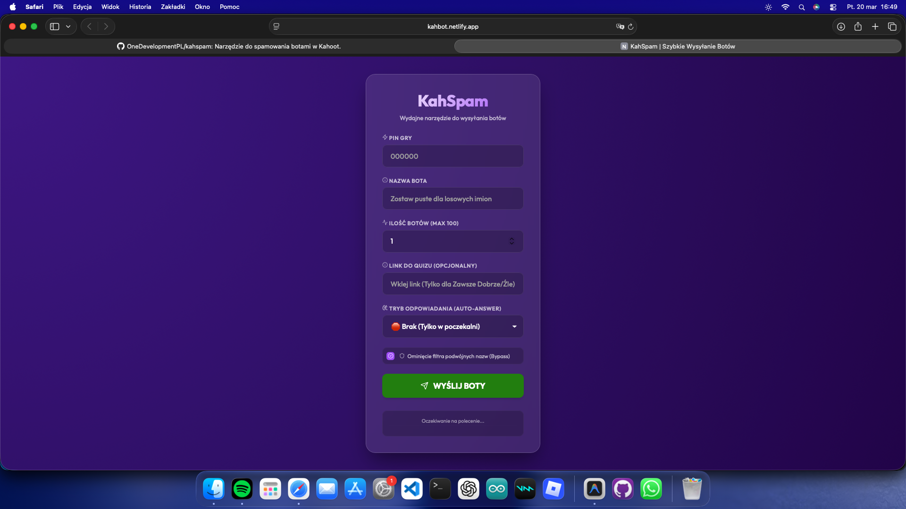

# 🚀 KahSpam - Elitarne Narzędzie do Dominacji w Kahoot

**KahSpam** to najbardziej zaawansowane, polskie narzędzie typu "User Deployment", zaprojektowane z myślą o pełnej kontroli nad każdą sesją Kahoot. To nie jest zwykły spamer – to kompletny system zarządzania botami, który pozwala na realną interakcję z grą i pełną personalizację ataku.

---

## 🔥 Co wyróżnia KahSpam?

Większość dostępnych narzędzi oferuje jedynie proste dołączanie do lobby. **KahSpam** idzie o kilka kroków dalej, oferując unikalne funkcje stealth i automatyzacji:

### 🛡️ System Stealth (Bypass Filters)
Kahoot posiada zaawansowane algorytmy wykrywające duplikaty nazw i boty. KahSpam omija te zabezpieczenia za pomocą techniki **Zero-Width Character Injection**. Każdy wysłany bot otrzymuje unikalną kombinację niewidocznych znaków Unicode (`\u200B`), co sprawia, że:
-   **Host widzi**: 50 identycznych nazw (np. "TwojaNazwa").
-   **Serwer Kahoot widzi**: 50 unikalnych użytkowników.
-   **Efekt**: Pełny bypass filtrów duplikatów.

### 🎲 Inteligentna Generacja Tożsamości
Jeśli chcesz, aby Twoje boty wtopiły się w tłum, KahSpam posiada wbudowaną bazę **popularnych polskich imion**. System automatycznie przydziela tożsamości takie jak "Kacper", "Maja" czy "Mateusz", dodając do nich subtelne identyfikatory numeryczne. Dzięki temu lobby wygląda naturalnie, a nie jak zautomatyzowany atak.

### 🧠 Auto-Answer Engine (Sztuczna Inteligencja)
To serce KahSpam. Boty nie tylko siedzą w lobby – one grają za Ciebie:
-   **Tryb Geniusza (Zawsze Dobrze)**: Po podaniu linku do quizu (format `create.kahoot.it/...`), system pobiera klucz odpowiedzi bezpośrednio z API. Boty klikają poprawną odpowiedź w losowym odstępie czasu (1-5s), aby imitować ludzki refleks.
-   **Tryb Chaosu (Losowo)**: Boty wybierają różne odpowiedzi, tworząc realistyczny szum w statystykach i utrudniając prowadzącemu orientację.
-   **Tryb Trolla (Zawsze Źle)**: Boty aktywnie unikają poprawnych odpowiedzi, co jest idealne do sabotowania średniej wyników grupy.

### 📦 System Batching & Load Balancing
Wysyłanie dużej ilości botów na raz często kończy się błędem "Rate Limit" ze strony serwerów Firebase/CometD. KahSpam posiada wbudowany silnik **Batchingu**, który wysyła boty w zoptymalizowanych paczkach, zapewniając stabilność połączenia nawet przy słabym łączu.

---

## 🧐 Najczęściej Zadawane Pytania (FAQ)

**1. Czy boty zostają w grze po jej rozpoczęciu?**
Tak! Dzięki zastosowaniu dedykowanego backendu stateful, boty utrzymują aktywne połączenie WebSocket przez całą sesję, pozwalając na zbieranie punktów i pojawianie się w rankingu.

**2. Czy prowadzący może wykryć boty?**
Jeśli używasz losowych imion i trybu "Chaos", wykrycie botów jest bardzo trudne. W przypadku trybu "Bypass" z identycznymi nazwami, host od razu zauważy, że coś jest nie tak, ale nie będzie w stanie ich zablokować przed dołączeniem.

**3. Skąd wziąć link do quizu?**
Link do quizu znajdziesz najczęściej na stronie głównej Kahoota w wyszukiwarce lub w bibliotece nauczyciela (jeśli masz do niej dostęp). Bez linku boty będą strzelać losowo.

---

## 🎨 Design klasy Premium
Zapomnij o brzydkich konsolach i prostych formularzach. KahSpam oferuje:
-   **Glassmorphism UI**: Przezroczyste panele z efektem rozmycia tła (backdrop-filter).
-   **Vibrant Gradients**: Żywa, fioletowo-purpurowa kolorystyka zgodna z estetyką marki.
-   **Floating Shapes**: Dynamiczne kształty geometryczne (trójkąty, romby, koła) w tle, nawiązujące do interfejsu Kahoot.
-   **Real-time Console**: Logi na żywo informujące o każdym dołączonym bocie, statusie paczek oraz sukcesach silnika Auto-Answer.

---

## 🚀 Możliwości Rozwoju
Projekt KahSpam jest stale rozwijany. Planujemy dodać:
- [ ] Tryb walki o Podium (wybrany bot zawsze na 1 miejscu).
- [ ] Obsługę pytań otwartych i typu "Puzzle".
- [ ] Panel admina do wyrzucania konkretnych botów w trakcie gry.

---

## ⚠️ Zasady Użytkowania
Narzędzie zostało stworzone w celach edukacyjnych i testowych (Stress Testing). Autorzy nie ponoszą odpowiedzialności za niewłaściwe wykorzystanie aplikacji w celach zakłócania oficjalnych konkursów czy zajęć lekcyjnych. Pamiętaj o etyce i używaj narzędzia odpowiedzialnie! 😉

---
*Created with ❤️ by OneDevelopment*
